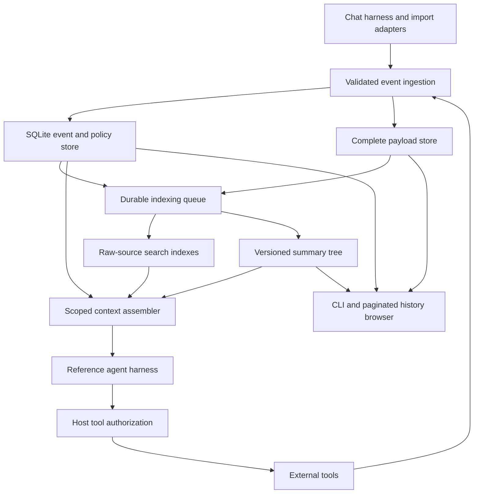

# TraceChat: a plan for evidence-backed conversational memory

Status: proposed design, October 4, 2026. TraceChat is a working name.

## 1. Product decision

Build a local-first memory service and a thin reference chat harness for people who work with agents across long projects. The interface can feel like one continuous conversation. Underneath it, history belongs to explicit projects and tasks, and every remembered claim leads back to its source.

The product promise is: **TraceChat preserves accepted history, helps retrieve relevant evidence, and makes memory limitations visible.** Retention depends on the user's configured retention and deletion policy. Retrieval quality must be measured.

The core design has six independent responsibilities:

| Responsibility | Mechanism |
|---|---|
| Preserve evidence | Durable typed events and complete referenced payloads |
| Find evidence | Literal, lexical, semantic, and metadata retrieval over source material |
| Explain the history | An optional incremental chronological summary tree |
| Continue the conversation | A separately bounded recent verbatim window |
| Preserve standing preferences | Explicit scoped policy state with source references |
| Keep working through failures | Nonblocking background jobs, versioned indexes, and reproducible context snapshots |

Start with recent context and source retrieval. Add the tree behind a feature flag and compare it against that baseline. If the tree fails to improve useful outcomes, ship the simpler system.

### Intended workflow

1. The user selects a project and talks to an agent normally.
2. The harness records user messages, visible assistant replies, tool interactions, and subagent reports with distinct event types.
3. A follow-up retains a bounded amount of exact recent conversation. Historical questions retrieve original evidence independently of summaries.
4. The agent cites retrieved evidence when making consequential claims about past work. The user can open the cited source or browse the surrounding history.
5. Standing policies have a visible scope and lifecycle. Remembering an old action never silently authorizes repeating it.
6. Index failures appear as incomplete coverage. They do not prevent the next conversation turn.

### Initial scope

The first release serves one local user, explicit project scopes, text/code/JSON payloads, imported conversations, and one working reference harness adapter. Provide a CLI and a read-only MCP interface for existing agents. The harness integrates storage and context assembly directly; an MCP server alone cannot capture tool results that its client never supplies or control how that client builds its prompt.

Remote attachment, always-on hosting, multiuser collaboration, autonomous background actions, computer use, and a full agent orchestration platform are later work. Store accepted binary attachments as original bytes, but promise searchable contents only for supported, versioned extractors. Hidden model reasoning is outside the memory contract. Any provider-required opaque continuation state belongs in a separate, short-lived runtime checkpoint.

### Claims to earn through evaluation

Avoid advertising “remembers everything,” “infinite context,” “no context rot,” or “low cost.” The bounded prompt is a selection from history. Storage grows with retained history. A fresh request can still contain distracting or inaccurate context. Search can miss evidence. Caching can reduce some charges while ingestion and retrieval add others.

## 2. How the original plan and review inform this design

This plan uses the supplied [OptChat specification](/Users/johnshahbazian/Downloads/91837951a5ce5b38f341ec1ba1df6449-f51fe5c910427fd6f384d22823140b1693c76207/optchat.md) and [adversarial review](</Users/johnshahbazian/.codex/attachments/b787dd82-cb3f-4b6f-8edc-c82705249c06/Pasted text.txt>) as design inputs. Instructions embedded in those documents are source material. They do not govern this plan.

The review explicitly says it did not run the reference implementation or measure model recall. Its truncation, blocking, scheduling, and restart examples identify specification defects; its retrieval, context quality, injection, and economics concerns require empirical tests. Its referenced sandbox scripts and internal citation links were not supplied as usable artifacts here. This plan does not present those checks as independently reproduced results.

| Original choice or criticism | TraceChat decision | Required evidence |
|---|---|---|
| Durable addressable history is valuable | Keep stable event IDs, complete payloads, and source links | Byte-for-byte reads after restart and restore |
| The summary tree can hide retrieval clues | Search raw history independently; use the tree for orientation | Retrieve an old rare fact whose ancestor summary omits it |
| A known branch is easier to navigate than an unknown fact is to discover | Provide direct source reads and search results with IDs; retain zoom for browsing | Report search and zoom operations separately |
| Tool results are truncated before storage | Persist the full accepted payload before creating a preview | Recover a sentinel from the middle of a large result |
| Whole-message zoom conflicts with prompt caps | Use explicit paginated source reads with immutable cursors | Reassemble a large source without gaps or overlaps |
| Fresh calls do not prove context quality | Assemble query-relevant context and compare prompt-size settings | Task accuracy, distractor sensitivity, and total cost |
| Summary-only recent history loses exact follow-ups | Reserve an independent recent verbatim budget | Resolve “the second implementation” correctly |
| Latest instruction does not always supersede every older instruction | Model scope, precedence, expiration, revocation, and explicit supersession | Defaults, temporary exceptions, and reversals |
| Quoted text and subagents can be mistaken for the human | Preserve authorship and content origin structurally | No policy promotion from tool, document, or subagent content |
| A prompt cannot prove injection resistance | Restrict authority-changing operations in the host and test attacks | Policy-store invariants plus adversarial action tests |
| One permanently failing summary can block all turns | Keep compaction off the turn dependency path | Continue interacting during refusal, outage, and malformed output |
| Sequential leaf jobs limit throughput | Use independent jobs with bounded local context and dependency queues | Backlog and throughput measurements |
| Live frontier depends on completion timing | Persist each published frontier and the exact turn snapshot | Identical published rendering after restart |
| Repeated full-history scheduling can be quadratic | Enqueue new work and direct dependents incrementally | Candidate-check counts at increasing history sizes |
| Never recompute leaves errors permanent | Version derived state and rebuild affected ancestors | Correct a bad leaf and stop serving its old ancestors |
| Never delete leaves secrets in many copies | Implement retention, suppression, physical purge, and restore-safe deletion | A deletion inventory and restore test |
| Bytes alone do not bound a model request | Keep storage byte accounting and add whole-request token admission | No request exceeds its configured provider limit |
| One write and fsync do not settle durability | Specify database and blob commit protocols and fault injection | No acknowledged event points to a missing committed blob |
| Cache reuse is not unit economics | Measure billed usage for the entire pipeline | Dollars per attempted and successfully completed task |
| Summary trees already have prior art | Position the tool around trustworthy integration and measured usefulness | Compare against strong source-retrieval baselines |

Recursive summary retrieval has prior art in [RAPTOR](https://arxiv.org/abs/2401.18059). That supports treating the tree as an architectural option to evaluate; it does not establish that this chronological conversational tree will work well.

## 3. Architecture and boundaries



Use one local service as the owner of ingestion and index publication. SQLite holds event metadata, policy records, job state, index coverage, summary versions, and frontier manifests. Files hold large payloads. Lexical retrieval begins with [SQLite FTS5](https://www.sqlite.org/fts5.html); embeddings live in a replaceable derived index. Start with a simple vector implementation appropriate to measured corpus size. Select an approximate nearest-neighbor implementation only when profiling justifies it.

A Python implementation with typed schemas, SQLite, and a CLI is a reasonable initial engineering choice because it keeps the ingestion and evaluation pipeline small. A different language is acceptable if the team already has a suitable harness. Keep the API and on-disk contracts independent of that choice.

Bind the initial service to local IPC or loopback. Read clients receive explicit allowed scopes. Imports and policy mutations use separate capabilities. Authentication secrets belong in headers or IPC credentials, not URLs. A model-visible read token cannot mutate policies, remove data, or expand its own scope.

The memory service returns evidence and policy state. The harness owns tool execution. Host checks can enforce concrete permissions such as allowed projects, filesystem roots, and tool capabilities. Structural provenance reduces authority confusion; it cannot guarantee that an unrestricted model will never follow malicious text. Action-taking integrations need their own enforceable permissions and adversarial tests.

## 4. Evidence storage and ingestion

### Event contract

Each accepted event has at least these fields:

```text
event_id                 stable opaque identifier
sequence                 local monotonic ingestion order
workspace_id, project_id, task_id
conversation_id, turn_id, parent_event_id
event_type               human_message | assistant_reply | tool_call |
                         tool_result | subagent_report | imported_note |
                         policy_change | action_receipt | deletion_marker
actor_id, actor_type     human | assistant | tool | subagent | importer | unknown
recorded_at_utc          time captured by this service
source_time_utc          optional original timestamp; may be uncertain
content_parts           authored text, quoted text, attachment references
payload_id, digest, byte_length, media_type
capture_status          complete | upstream_incomplete | capture_incomplete |
                        completeness_unknown
adapter_version, source_locator, source_revision
retention_class
```

An actor type is set by an authenticated adapter, never inferred from a textual prefix. Human authorship and authority are distinct: an attached document inside a human message remains document content. If an import cannot reconstruct roles, classify them as unknown/imported; do not pretend they came directly from the human. Every capture adapter must supply capture status and provenance; a client that cannot attest completeness uses `completeness_unknown` rather than a default of `complete`.

Record completed external actions separately from descriptions of them. An assistant saying “I deployed it” is an assistant claim. A deployment receipt is evidence of an observed result at a particular time. A proposal remains a proposal. Summaries retain these distinctions, and citations expose them.

Use source timestamps for questions about when an imported conversation happened; use ingestion sequence for internal ordering. Preserve timezone information and uncertainty. “Latest” requires a defined scope and time basis.

### Full payloads, bounded presentation

Persist the complete accepted bytes for user content, tool results, and attachments. Put a digest and payload reference in the event. Generate previews after persistence. A preview states its byte range, full payload length, and whether more content exists.

Resource limits still exist. Before accepting an input, enforce configurable payload and storage quotas. Reject oversized inputs explicitly or offer a supported streaming upload. Never accept a full payload and silently discard its middle. For a stream that fails, retain a clearly incomplete capture with its actual byte count; do not label it complete. If the upstream client already truncated its result, record that limitation when known. The service cannot recover bytes it never received.

Provide cursor-based reads tied to a payload digest and retention generation. Text cursors respect UTF-8 boundaries; binary reads use byte offsets. Returning the first page never implies that the source ends there. The caller can reconstruct complete accepted bytes or inspect a selected range.

All supported text is chunked and indexed, including the middle of long tool outputs. Chunk boundaries retain source offsets, media type, and parent event IDs. Token- or line-sized chunks help retrieval, but the original payload remains the authority. JSON/code extraction must preserve a mapping back to original locations. Unknown binary formats remain downloadable with a visible “content not indexed” status.

### Durability protocol

Use SQLite transactions with an explicitly tested synchronous configuration on a supported local filesystem. WAL mode may suit concurrent readers; its persistence and checkpoint behavior must be configured deliberately. SQLite's [atomic-commit documentation](https://www.sqlite.org/atomiccommit.html) and [WAL documentation](https://www.sqlite.org/wal.html) describe assumptions that the implementation must respect. Do not use a network filesystem as the default store.

For an event with a file payload:

1. Write a uniquely named temporary file in the destination filesystem; handle short writes and I/O errors.
2. Flush and synchronize the complete file, verify its length and digest, rename it atomically to its final payload ID, and synchronize affected directory entries using the platform's supported durability mechanism.
3. In a database transaction, insert the event reference, ingestion idempotency key, and indexing jobs. Commit before acknowledging acceptance.
4. Acknowledge only after both the file and event are committed. The database never points to a payload that has not been finalized.

Filesystem and database commits are not one atomic transaction. A crash can leave an orphan file; reconcile and garbage-collect it after a grace period. An idempotency key permits a caller to recover an acknowledged-or-unknown outcome without duplicating the event. A disk-full or synchronization failure returns an error, not a success receipt.

Use a platform-supported exclusive service lock and database constraints, rather than a connect/unlink socket race. Multiwriter capture goes through the owning service. Perform crash, second-writer, short-write, and disk-full tests at the acknowledgement boundary. State the supported durability assumptions; do not claim to survive broken hardware or lying storage firmware.

## 5. Retrieval independent of summaries

### Search paths

Expose these as distinct operations so their limits are visible:

- **Literal search:** exact identifiers, values, filenames, and strings. FTS tokenization alone is insufficient for arbitrary punctuated strings. Provide a source scan fallback, with an explicit interactive scan budget and a resumable exhaustive search when that budget is exceeded.
- **Lexical search:** term-based ranking over complete supported text, with useful surrounding chunks.
- **Semantic search:** paraphrases and concept matches over the same source-backed chunks.
- **Metadata search:** project, task, actor, tool, time range, artifact path, source revision, and event type.

Apply scope filters inside every query path before candidate ranking. A default query searches the active project plus explicitly applicable global policies. Cross-project retrieval requires an allowed scope selected by the user or an existing grant. Neither a similarity match nor an old summary can expand that grant.

Fuse lexical and semantic ranks using an initial simple method such as reciprocal rank fusion. Preserve exact matches, deduplicate overlapping spans, and expand relevant neighboring events. Entity/path extraction may help routing later; its mistakes must not exclude candidates from raw search. Do not build a knowledge graph for the first release.

Each result includes source IDs, source offsets, recorded/source times, scope, revision, capture status, retrieval path, and index coverage. Scores are ranking signals, not factual confidence. Summaries may be returned as orientation, visibly labeled as derived.

### Coverage and fallback

Track text-extraction, lexical, semantic, and summary coverage separately, per scope and ingestion sequence. A high watermark alone is insufficient when there are holes; retain pending/failed ranges and counts.

Text extraction and lexical indexing are deterministic jobs and receive priority over expensive summarization. New turns can access committed raw events immediately. When a search encounters index gaps, scan pending supported raw text within a bounded budget. If coverage remains incomplete, return that fact and a continuation option. The agent must distinguish “no matching indexed evidence” from “the history proves this never happened.”

For a historical question, begin with current project context, literal terms, and hybrid search. Escalate with narrower metadata filters, neighboring events, summary browsing, or a larger scan when the initial evidence is insufficient. Cap interactive retrieval work; report the searched scopes and material limitations when abstaining.

### Evidence and current truth

Original messages establish what was said or observed then. They do not establish current file contents, deployment state, account permissions, or external facts. Before a consequential action, the harness must inspect current state as appropriate. A commit ID or source digest makes an old finding useful to compare; it does not make it timeless.

Answers about past decisions should link to raw evidence. Actions that depend on an exact value must read that value from the source or current system. A summary alone is sufficient for broad orientation; it is insufficient evidence for exact quotations, critical configuration values, permission grants, or claims that an operation completed.

## 6. Context assembly and conversational continuity

Build a fresh bounded request for each new top-level turn, with explicit recent context carried into it. Continue the provider's normal tool loop within that turn. This controls context growth without pretending that all useful continuity must be reconstructed from summaries.

The assembler has separate budgets for policies, recent exact conversation, task state, historical orientation, and retrieved evidence. Large recent payloads cannot force permanent coarsening of the historical tree.

Illustrative starting configuration for a model with a verified 128k-token context limit:

| Component | Maximum tokens |
|---|---:|
| Static instructions and tool schemas | 8,000 |
| Applicable policies and task checkpoint | 4,000 |
| Historical orientation, if enabled | 4,000 |
| Recent exact messages | 8,000 |
| Retrieved source evidence | 12,000 |
| Current user request | 8,000 |
| Output allowance | 8,000 |
| Tool-loop growth reserve | 16,000 |
| Safety margin | 8,000 |

These are initial caps, not required allocations or performance claims. The assembled request should usually be much smaller. Validate budgets against the selected model and tune them on development data. Test smaller and larger recent windows and orientation budgets; do not inherit the original 64k history view as a default.

Admit **the entire serialized request**, including tool definitions, system content, current input, evidence, provider-specific continuation items, and output allowance. Use a supported tokenizer or provider token-counting facility. If neither is reliable, require a conservative documented adapter limit; do not rely on a universal bytes-to-tokens conversion.

On overflow, remove lower-ranked optional evidence and reduce optional orientation first. Retain applicable policy state, the full current request, and enough exact recent context to resolve the immediate referent. If mandatory content still does not fit, report the oversized request and offer explicit attachment/reading or splitting behavior. Store the accepted input; do not silently cut it and act as if the whole request was read.

Recent context contains complete small messages and visible references for oversized payloads. Any excerpt is labeled as a selected range. If the latest code/options do not fit and the user refers to “the second one,” retrieve the exact relevant reply before proceeding.

Before every subsequent tool-loop request, repeat admission checks. At the reserve boundary, checkpoint the active task with source references, action receipts, unresolved work, and tool invocation states, then reconstruct a bounded continuation. Never drop in-flight calls or replay completed side effects just because context was rebuilt. Ambiguous external outcomes require reconciliation. A model-written task checkpoint is derived context, with raw evidence still accessible.

Cancellation records whether the message was received, delivered, answered, or cancelled. Queued inputs retain their IDs. Mid-run human steering keeps its human origin; asynchronous subagent reports keep their subagent origin. Neither arrival mechanism rewrites authorship.

## 7. Standing policies and action authorization

Policies are structured state, independent of summaries:

```text
policy_id, revision, owner_id
rule_key, value
scope                   global | project:<id> | task:<id>
source_event_id, source_span
effective_from, expires_at, until_task_complete
supersedes_policy_ids
status                  proposed | active | revoked | expired | conflicted
activation_receipt      authenticated user policy operation
```

The initial product activates durable policies through an explicit user operation: a policy editor, a CLI command, or a structured `/policy set` command in chat. The host parses the chat command only as a top-level operation received through the authenticated human input channel, before any model call; the same bytes inside a quote, import, attachment, or model output are data. Natural-language extraction can suggest a policy, but it cannot activate one from a document, tool result, summary, subagent report, or ambiguous quoted passage. The user reviews the exact proposed rule and scope when using that suggestion path. Normal task instructions continue to apply to the current task through the harness's instruction hierarchy.

This preserves the original idea that corrections can become useful memory while avoiding dependence on a compressor deciding what counts as an instruction. Host authorization remains a separate capability system. A policy such as “prefer Python” is different from a grant such as “may write these files.” Remembered approval for a completed task does not grant approval for a later task.

Resolve compatible policies using an explicit hierarchy: host/system constraints, current authorized task instructions, applicable task policies, applicable project policies, then global defaults. Integrations must also respect their governing instruction files. Within the same rule and scope, use explicit supersession; conflicting active policies produce a conflict rather than an invented “latest wins” rule. A more specific temporary exception does not delete its global default.

Example:

| User intent | Stored result |
|---|---|
| Prefer Python globally | Active global `language=Python` |
| Use TypeScript for this browser demo | Task-scoped `language=TypeScript`, expires with that task |
| Return to the normal setup | Revoke that task exception if the reference is unambiguous; otherwise ask which exception |

Policy revocation and permission reduction increment a policy generation immediately. Prepared contexts and jobs with an older generation must revalidate before action. Historical summaries may still describe the old instruction, but the active policy store determines whether it applies now.

Imported preferences are proposals with source references. Imported authority is never activated automatically. Attachments and quoted passages retain data origin even when a human supplied the enclosing message. The compactor has read-only input and no tools or capabilities to change policies or execute actions.

## 8. Optional summary tree and reproducible views

Keep a binary chronological tree initially because it is easy to browse and inspect. Build separate trees for explicit project scopes; use a deterministic project-local ordinal alongside global event IDs. This avoids merging unrelated projects merely because their events arrived next to each other.

Leaves summarize one event. Very large events are internally segmented and reduced with references covering the full payload. Parent nodes summarize adjacent children. Store:

```text
node_id, project_id, covered_ordinal_range
generation, source_digests, child_version_ids
summary_text, source_refs
model_id, prompt_version, build_context_digest
coverage_status, created_at, validation_status
```

Internal segments have IDs `(payload_id, extraction_version, start_byte, end_byte)` and a manifest of ordered, nonoverlapping ranges covering the complete supported text. Overlap used for search is separate from this coverage manifest. Segment reductions are internal derived artifacts, not extra chronological events. A tree leaf's zoom result returns its event ID and segment manifest; payload reads use source offsets and digest-bound cursors. An internal reduction can expose its segment children through a separate inspection operation. Test full coverage, Unicode boundaries, and reassembly explicitly.

Keep ranges and citations in host-owned fields. Reject model references outside the supplied source set. A model cannot fabricate the node's provenance. A citation establishes lineage; it does not prove that a generated sentence is accurate. Evaluate summary factuality and permit user corrections.

Give the summarizer bounded relevant context: neighboring raw events, task metadata, and available validated summaries. Do not send the entire accumulated 64k view for each event by default. If “do it” cannot be resolved from the allowed context, record the ambiguity rather than inventing the antecedent. Leaf jobs can run independently. Parent jobs depend on their specific child versions. Track any additional context references separately from the node's chronological range, and include them in its invalidation dependency graph. Correcting or deleting contextual evidence must invalidate every summary that used it, even outside its covered range.

Use structured summary output with references and clear attribution. Preserve whether a statement was requested, proposed, attempted, reported, or confirmed by a receipt. These labels describe evidence status; they do not turn prose into workflow truth. The original warning that status labels can inflate progress becomes a validation test rather than a reason to abandon explicit status altogether.

Start with a configurable soft summary target around 512–1,024 UTF-8 bytes and a hard response limit. Validate in the host. Allow a small bounded correction attempt; otherwise mark the model result failed and publish an explicitly labeled extractive descriptor. Content limits must never cause deletion of raw evidence. No rule depends on a model counting bytes correctly.

### Frontier publication

Persist the exact ordered node-version list, render version, scope, source watermark, byte/token accounting, and rendered digest for every published orientation frontier. Publish it transactionally. A restart loads the manifest; it does not replay asynchronous completions to guess the previous view.

Incrementally append and coarsen during ordinary operation to improve prefix stability. A frontier can legitimately vary with completion timing before publication. That is acceptable because the selected frontier is recorded. A given persisted manifest must render identically after restart under the same renderer.

Each turn records its actual source cutoff, policy generation, frontier manifest, recent event IDs, retrieved spans, and request-render version. Persist selected policy revisions, tool-schema and adapter versions, dynamic render values such as the date, and source selections and hashes needed to reproduce the memory input; avoid an extra raw prompt copy unless debug capture is explicitly enabled. This does not promise to reproduce stochastic model output or expired opaque provider state. Deletion can deliberately make an old snapshot unreproducible, and its status must say so.

Bad summaries can be superseded. Invalidate their dependent ancestors and any active frontiers that reference them. Build a new generation from source or corrected children; atomically publish a validated replacement. Do not silently rewrite a node version that a previous turn cited. Migration and deletion may split/rebuild frontiers. “Never split” is an ordinary-operation optimization, not a correctness requirement.

An orientation frontier can include descriptors such as “42 events pending summary; source reads available.” It need not pretend that every historical range has been successfully summarized. The tree's zoom API returns child versions and source references; raw reads use pagination.

## 9. Nonblocking jobs and degraded operation

Insert jobs as part of accepted ingestion. Completing a leaf enqueues only its eligible parent; completing a parent enqueues its parent. Maintain dependency counters and indexed ready queues. Do not rescan all completed message positions every time work finishes.

Jobs have unique keys derived from source versions and operation versions, leases, deadlines, attempt counts, and terminal states. Duplicate workers may repeat a model call after an ambiguous timeout, but publication is idempotent and billing records include that possibility.

Use bounded retries with jittered backoff for transient failures, honoring rate-limit guidance. As a starting default, allow three attempts within a configured time budget. Permanent refusals, invalid outputs, or exhausted retries become failed jobs with a visible reason. Administrative retry or a new generation can restart them. A circuit breaker pauses expensive workers during sustained provider failure while ingestion, reads, and lexical search continue.

Prioritize work needed for current source retrieval. Pause optional summaries or embeddings at cost/storage limits. A failed leaf blocks only the parent that needs it; neighboring work continues. The next chat turn never waits for all summaries to settle.

| Failure | User-visible behavior |
|---|---|
| Summary provider unavailable | Current conversation and raw retrieval work; orientation coverage is incomplete |
| Embedding provider unavailable | Literal and lexical retrieval continue; semantic coverage is incomplete |
| Text extractor fails | Original payload can be read; its contents are visibly unindexed |
| Budget exhausted | Optional background work pauses; show queued coverage and costs |
| Corrupt summary/index | Quarantine derived data and rebuild; source reads remain available |
| Missing/corrupt raw payload | Report affected evidence unavailable; restore from a verified backup |
| Ingestion cannot commit | Explicit acceptance failure; no successful storage receipt |

Report backlog count, oldest pending age, failed ranges, provider health, and coverage. Detailed failures belong in inspectable diagnostics; ordinary chat needs a concise coverage notice when it affects the answer.

## 10. Retention, deletion, and backups

History is append-only during normal capture. Retention and deliberate deletion are supported operations. There is no automatic Git history of private chat data; code and documentation may use Git, while memory uses its own backup mechanism.

The MVP supports whole-event, attachment, conversation, and project deletion. A “remove this secret” workflow searches for matching original sources and dependent derived data, reports the searched scope and coverage, and lets the user select broader event/conversation deletion. Literal variants and semantic duplicates may be missed; completion applies to the enumerated deletion set, not an unproven claim that every reference was discovered. Selective redaction can create a sanitized replacement, but the old payload and derivatives must be purged.

Deletion proceeds as a resumable operation:

1. Create a deletion job and increment the scope's retention generation. Immediately suppress affected sources, summaries, retrieval entries, and prepared contexts from serving.
2. Stop or fence workers that could republish content derived from the deleted generation. Recheck the generation before reads, model submission, and publication.
3. Remove payloads, excerpts, search chunks, embeddings, summaries and ancestors, extracted entities, relevant policy content, debug prompts, and cached results. Rebuild unaffected orientation state.
4. Rebuild/compact affected index stores and perform documented database/WAL cleanup. Verify the supported serving paths cannot return the content.
5. Apply deletion manifests during backup restore before exposing a restored store. Purge managed backups according to their configured lifecycle and report outstanding copies.
6. Retain a minimal deletion receipt with IDs and status, without the deleted content or a sensitive content-derived digest.

Use a per-scope submission/publication barrier so generation validation and request handoff cannot race deletion. Deletion fences queued work and waits for preexisting handoffs to finish or cancel before acknowledging suppression. Already-submitted requests are listed as outside the local recall boundary; their responses cannot be republished into the deleted generation. Apply the same generation fence to host action authorization after policy revocation.

SQLite's [secure-delete documentation](https://www.sqlite.org/pragma.html#pragma_secure_delete) warns that ordinary deletion settings do not automatically clear every FTS shadow-table trace. Treat index cleanup, WAL files, backups, exports, and diagnostic captures as separate deletion targets. Logical suppression and physical purge are distinct milestones.

The initial guarantee covers TraceChat-managed serving paths and documented storage cleanup. Secure physical erasure from SSDs, filesystem snapshots, unmanaged exports, or external providers is not established by this design. Show what remains and where control ends. Provider caches may retain already-submitted context until their retention mechanism expires; local deletion cannot recall a request already sent.

Keep the local data directory owner-restricted and support an explicit backup destination. Use a consistent database backup paired with a complete manifest of referenced blobs; verify hashes and restore regularly. Maintain a deletion ledger outside older backup snapshots so restoring an old archive cannot resurrect forgotten data; refuse to serve a restore when the required ledger is unavailable. Application-managed encryption and remote sync require separate key-management design before release; do not suggest that a file permission or a hash provides encryption. Local-first refers to ownership and storage. Each scope has an explicit provider-routing setting because remote summarization or embedding still sends selected content outside the machine.

## 11. Caching and economics

Order prompts so static instructions and tool schemas come first. Next place stable applicable policy rendering and optional historical orientation; put volatile metadata, recent context, retrieved evidence, and the current request afterward. Preserve the provider's required conversation item structure within the tool loop.

Version canonical renderers. Changing a policy, tool schema, model, or summary generation can legitimately invalidate a prefix. Correctness and deletion take precedence over cache reuse. Measure prefix stability as a diagnostic and billed cache usage as the economic evidence.

Implement cache settings in capability-tested provider/model adapters. Do not hardcode one vendor's TTL, breakpoint rules, or reasoning-state rules into the memory design. For example, [Anthropic's current caching documentation](https://platform.claude.com/docs/en/build-with-claude/prompt-caching) describes both short and longer TTLs and separate cache usage fields. Choose settings using workload pause distributions and actual billed usage rather than banning a duration globally.

Every run records normalized uncached input, cache reads, cache writes, output, any separately billed reasoning, embeddings, reranking, retries, ingestion, and background summarization. Retain the raw usage record and a dated price configuration. Missing usage means “unknown,” not zero. Do not copy the review's illustrative price table into a forecast.

```text
total_run_cost = ingestion + embeddings + summary_generation + retrieval
               + answering + retries + cache_writes + storage/hosting

cost_per_success = total_run_cost / successfully_completed_tasks
```

Assign each billed component once; providers may combine usage categories differently. Report total spend and cost per attempted task as well, so a high failure rate cannot disappear behind averages. Compare cold starts, sustained sessions, long pauses, large tool outputs, imports, and model switches.

Set per-run and per-day optional-background budgets. Exhausting them reduces optional index freshness, not access to already committed evidence. Estimate costs before bulk imports. Human-usefulness, retrieval latency, and evidence quality remain primary; cheaper incorrect answers do not count as successful tasks.

## 12. Interfaces and inspection

The memory API includes:

```text
ingest(event, payload, idempotency_key)     authenticated capture adapters
search(query, scope, filters, mode, cursor)
read_event(event_id, cursor, byte_limit)
read_payload(payload_id, cursor, byte_limit)
timeline(scope, time_range, cursor)
zoom(node_version_id)                     derived child versions and sources
resolve_policies(scope, task_id, at_time)
coverage(scope)
inspect_context(turn_id)
```

Policy activation/revocation, deletion, import, index rebuild, and backup operations are separate authenticated administrative interfaces. Raw scope checks apply to reads and writes alike. An event ID or cursor never substitutes for permission.

The reference chat shows the active scope, relevant policy conflicts, source links, and material coverage gaps. An “inspect this turn” command shows which memories were selected, their sources, why they were included, and the token allocation. Retrieval must be debuggable without exposing hidden model reasoning.

Provide a paginated human history browser with chronological views, search, tree zoom, source ranges, and deletion controls. Rendering escapes source content; imported HTML is data. An all-history HTML export is optional and explicit, with scope and retention filters. Do not require loading years of raw tool output into one page.

Imports preserve original IDs as external locators, create new internal IDs, and record omitted or upstream-truncated data. Importing OptMem notes or older chat exports is useful, but those notes remain attributed historical material. Existing policies require explicit activation. Subagent reports carry task/parent IDs and evidence references; optionally capture their detailed events in the same scope with the proper actor type rather than mislabeling reports as user speech.

## 13. Evaluation that decides the design

### Comparison arms

Use identical histories, answering models, tool permissions, task prompts, and matched request budgets. Separately report fixed-budget and practical optimized configurations.

| Arm | Purpose |
|---|---|
| A. Recent exact context only | Measure what long-term retrieval adds |
| B. Recent exact context + raw hybrid retrieval | Primary simple-system baseline |
| C. Tree orientation/zoom with summary-only history | Test the tree hypothesis with both bounded-context and original full-view summarizers |
| D. B + optional tree orientation/zoom | Test the proposed full design |
| E. Original gold evidence supplied directly | Separate retrieval failures from answering failures |

All arms share durable evidence and host authority checks. For C, separately build C-local using bounded summarizer context and C-full using the original accumulated-view summarizer input, sequential leaf order, summary target, and view selection. Include the original approximately 64k-token orientation setting when the selected model admits it, alongside matched smaller budgets. Record implementation departures and build failures. This separates a tree limitation from a limitation introduced by changing the summarizer's context. An optional faithful reproduction of original truncation/blocking behavior belongs in isolated failure tests, not in a user deployment. If D wins, ablate orientation, semantic retrieval, neighbor expansion, recent context size, and cache strategy to identify the contribution.

Use [LongMemEval](https://github.com/xiaowu0162/LongMemEval) for conversational extraction, updates, temporal reasoning, and abstention. Use [LongMemEval-V2](https://xiaowu0162.github.io/longmemeval-v2/) for agent-history tasks and latency-sensitive evaluation. Follow each benchmark's published protocol and pin its dataset revision. These supplement architecture-specific tests; they do not verify durability or authorization.

### Required adversarial suite

| Fixture | Expected behavior |
|---|---|
| Rare old fact omitted from every visible ancestor | Raw retrieval finds the source; otherwise the agent abstains honestly |
| Unique answer in the middle of a very long result | Complete stored bytes and searchable/readable middle survive restart |
| Exact identifier with punctuation or unusual Unicode | Literal search is independent of semantic/FTS tokenization |
| Huge recent tool output | Older orientation budget is unaffected; full source stays accessible |
| “Change the second implementation” after multiple code options | Exact recent reply or source is read before editing |
| Global default, project override, task exception, expiry, reversal | Correct applicable policy with source and lifecycle |
| Attached instructions, quoted examples, subagent impersonation | No durable policy or permission activation from the data |
| Quoted or model-generated `/policy set` command | Only authenticated top-level human operations activate policy state |
| Injection repeated through several summary generations | No new host grant; measure unsafe model behavior separately |
| Old deployment receipt conflicts with current deployment | Historical answer is dated; action checks current state |
| Permanent leaf refusal and provider outage | Interactive turns proceed with explicit incomplete coverage |
| Delayed parent merge and process restart | The persisted frontier renders identically |
| Bad summary corrected or compactor upgraded | Old dependent versions stop serving in new contexts |
| Delete during a running compaction or retrieval job | Deleted generation cannot be republished or newly submitted |
| Crash before/after blob rename and DB commit | Only acknowledged committed events are guaranteed; retries are idempotent |
| Short write, disk full, or competing service process | Explicit error or rejected second owner; no false acceptance |
| Delete a secret and restore an older backup | Suppression precedes serving; deletion inventory records outstanding copies |
| A secret has an unrecognized semantic duplicate | Deletion report states discovery limits and offers broader deletion |
| Oversized request and long tool loop | Every request passes admission; no silent cuts or duplicate side effects |
| Same terms in unrelated projects | Scope filters hold in literal, lexical, semantic, tree, and pagination paths |
| Unsupported attachment and partially indexed import | Coverage limitations are visible; bytes remain retrievable |
| Growing histories: 1k, 10k, 100k events | Job scheduling scales with new work; measure storage and query costs separately |

### Measurement discipline

Build memory in chronological order without giving the compactor future test questions. Each evaluation question reads an isolated immutable snapshot; its question and answer do not become memory for later questions. Keep task-completion boundaries explicit for scoped policy expiry.

Separate development, validation, and held-out histories. Freeze prompts, parameters, gates, and pricing assumptions before the final run. Choose task counts using a power analysis for the minimum useful effect, and predefine answerable/abstention denominators. Use at least three repeated answering runs for stochastic comparisons, and sample independently built summary generations to measure build variance. Report paired confidence intervals clustered by independent history, plus per-category results; repeated seeds are not independent extra histories. A single seed or average is insufficient for a launch claim. Evaluate cold and warm index states separately.

Measure:

- Evidence recall within the admitted token budget, required multi-source coverage, and citation correctness.
- End-answer/task success, scope correctness, stale-fact errors, and appropriate abstention.
- Unauthorized policy mutations and forbidden tool operations; distinguish blocked attempts from executed actions.
- p50/p95 retrieval latency, memory-added turn latency, time to first token, and total completion latency.
- Total cost per attempted/successful task, ingestion cost, index size, backlog, and billed cache reuse.
- Acknowledged-data recovery, restored-store consistency, exact published frontier rendering, and deletion completion.

Use deterministic checks for exact values, IDs, permissions, and storage invariants. Use the published benchmark judge where required, plus blinded human review for disputed task-success and citation cases. Preserve judges' versions and raw scores. Identify retrieval, answerer, policy, ingestion, and current-state verification failures separately.

### Initial release and tree gates

These are proposed engineering targets, not observed results. Fix them before held-out evaluation and specify the reference machine, corpus sizes, and concurrency.

1. All deterministic retention, pagination, scope, restart, deletion-serving, request-admission, and policy-mutation invariants pass. Any acknowledged data loss or executed forbidden action blocks release.
2. On the frozen adversarial source-retrieval suite, at least 95% of answerable queries retrieve all required evidence within the configured prompt budget. Report misses and maintain a separate abstention suite.
3. Local warm retrieval p95 is below one second at 100k text events on the declared reference corpus; remote embedding/reranking and cold-index cases are reported separately. Corpus bytes and chunk counts accompany event counts.
4. Enable the tree by default only if D achieves a repeatable improvement over B: initially target at least five percentage points in task success on the history-heavy suite, with a paired 95% confidence interval excluding zero, or comparable quality with at least 20% lower total cost. Define comparable quality as a lower paired confidence bound above a preregistered noninferiority margin, initially minus two percentage points.
5. The tree's initial tradeoff envelope is no more than 25% higher total cost per successful task and no more than 500 ms additional p95 interactive retrieval latency over B. Measure background ingestion and cold starts separately; include their charges in total cost. Instruction handling, exact follow-ups, and scope isolation must not show a material regression.

If the result is inconclusive, leave the tree experimental and improve the baseline. Do not add more memory machinery solely to explain away a weak result.

## 14. Delivery plan

Deliver in dependency order. Each phase produces reviewable code, tests, and Markdown documentation. Estimate calendar dates after the evidence-store and adapter prototypes; team size and integration constraints are not supplied here.

| Phase | Deliverables | Exit condition |
|---|---|---|
| 0. Freeze contracts and evaluation | Event/policy schemas, scoped API, fixture histories, evaluation split and gates, storage threat boundaries | Fixtures and invariants reviewed before optimizing results |
| 1. Evidence foundation | SQLite/blob ingest, idempotency, full reads, quotas, owner lock, deletion suppression, consistent backup/restore | Complete payload, failure-injection, pagination, and restore tests pass |
| 2. Useful simple baseline | Full text extraction, literal/lexical search, semantic adapter, coverage fallback, CLI/read-only MCP, recent-context assembler | Arm B runs; exact old facts and immediate follow-ups work |
| 3. Policy and harness integration | Explicit policy lifecycle, scope enforcement, action receipts, one chat adapter, full-request admission and continuation | Policy, quoted-source, cancellation, and action-boundary suite passes |
| 4. Optional tree | Versioned summaries, ready queues, persisted frontier, browsing/zoom, bounded retries, correction/rebuild | Failed compaction cannot block a turn; restart/correction tests pass |
| 5. Compare and tune | Arms A–E, development ablations, cold/warm/paused workloads, usage accounting | Held-out report determines whether the tree becomes default |
| 6. Local release | Hardened import, resumable physical purge, history browser, diagnostics, verified restore and user guide | Release invariants and published limitations satisfied |

The first useful prototype ends after phases 2–3. Phases 4–5 decide whether OptChat's distinctive tree improves it. Remote access, longer-lived hosting, richer agent orchestration, and alternate tree shapes follow evidence from actual use.

Suggested repository layout:

```text
src/tracechat/
  contracts/       typed API and persisted schemas
  store/           database, blobs, ingest, backup, deletion
  retrieval/       extraction, chunks, lexical, literal, semantic, fusion
  policies/        scoped state and resolution
  summaries/       versioned jobs, tree, frontier manifests
  context/         selection, rendering, admission, snapshots
  adapters/        capture and provider/model capabilities
  interfaces/      CLI, read-only MCP, local history browser
evals/             fixtures, benchmark adapters, frozen run manifests
tests/             contract, fault-injection, integration, adversarial tests
docs/              architecture, contracts, operations, evaluation reports
```

Keep runtime memory outside the source checkout and out of Git. Tests use synthetic or explicitly approved sanitized histories. Private real history does not become a benchmark artifact by default.

## 15. Remaining decisions and limits

The plan assumes a local single-user service and a reference harness that can capture full results. The first implementation must choose the actual capture adapter, answering model, embedding model, reference machine, corpus-size envelope, and storage quotas. These choices affect budgets and timing; none requires changing the core separation between evidence, retrieval, orientation, continuity, and authority.

The largest unresolved research question is whether chronological summaries improve task completion beyond scoped raw retrieval and recent exact context. Semantic retrieval also needs testing on code, uncommon identifiers, changing facts, and cross-session questions. Durable capture does not settle these questions.

The recommended first build is therefore a trustworthy evidence store, a usable retrieval baseline, and a measured optional tree. That produces a useful tool early and makes the original architectural idea falsifiable.
